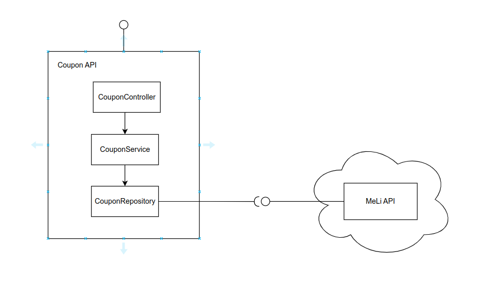
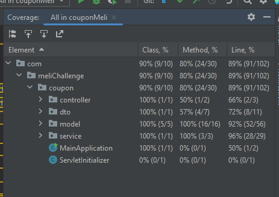

# COUPON MELI CHALLENGE
Api que obtiene ina lista de posibles productos a ser redimidos por medio de un cupon y responde cuales de esos articulos puedes ser redimidos realmente. 


## Tabla de Contenido
1. [Requisitos](#requisitos)
2. [Ejecución](#ejecución)
3. [Arquitectura](#arquitectura)
4. [Pruebas](#pruebas)
5. [Coverage](#coverage)
6. [Postman Collection](#postman-collection)


## Requisitos
***
Solamente requiere la posibilidad de ejecutar Java 8


## Ejecución
***
Para ejecutar el proyecto, como se desarrollo sobre el framework SpringBoot, basta con ejecutar el siguiente comando para inicializar el proyecto y subir los servicios: 
```
$ .\mvnw.cmd spring-boot:run
```


## Arquitectura
Se utilizó una arquitectura basica enfocada a servicios Rest. El proyecto se desplegó en un repositorio publico proporcionado por Heroku y se puede consumir por medio de la ruta: https://hmelichallenge.herokuapp.com/coupon utilizando una request como el siguiente:

```json
{
  "item_ids": ["MCO949183185", "MCO949183186", "MCO949183187", "MCO949183188", "MCO949183184"],
  "amount": 500000
}
```




## Coverage


## Postman Collection
Se anexa la colección de postman para pruebas: [here](https://github.com/DiegoAraque1207/coupon_challenge/blob/main/assets/Coupon%20Challenge.postman_collection.json)